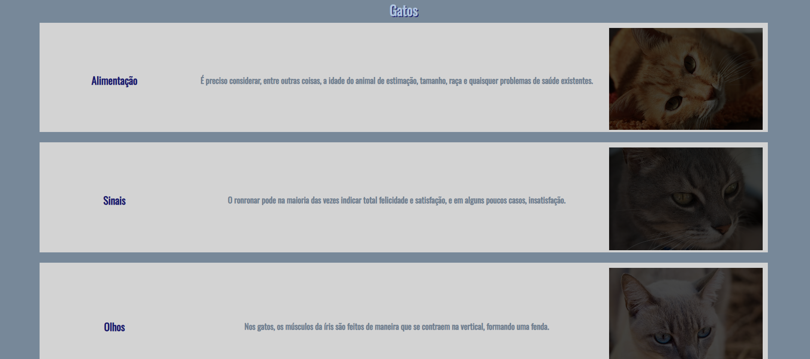
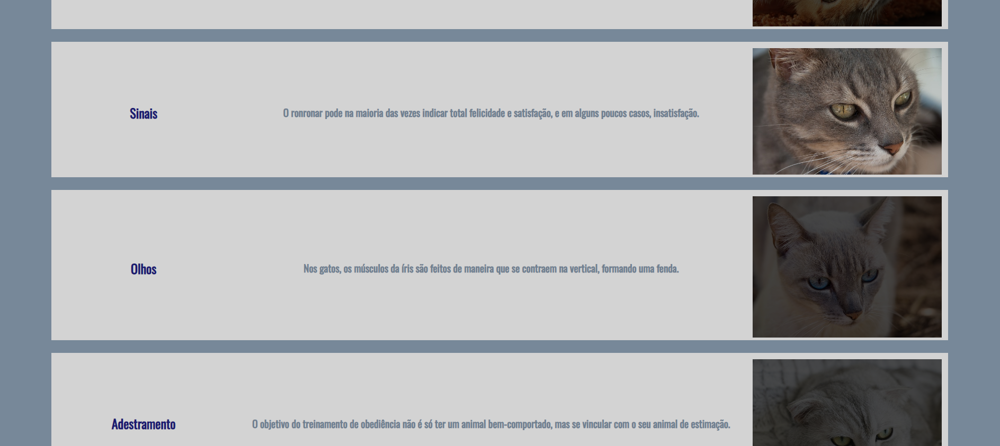

# siteGatosAulaCSS
página sobre gatos feita na aula de CSS na Etec de Guarulhos. Aula do prof Rodrigo no primeiro semestre de 2023.
  

  <h3>Uma página simples com uns gatos</h3>
  

  

  <h3>Quando coloca o mouse em cima, as cores voltam</h3>
  

